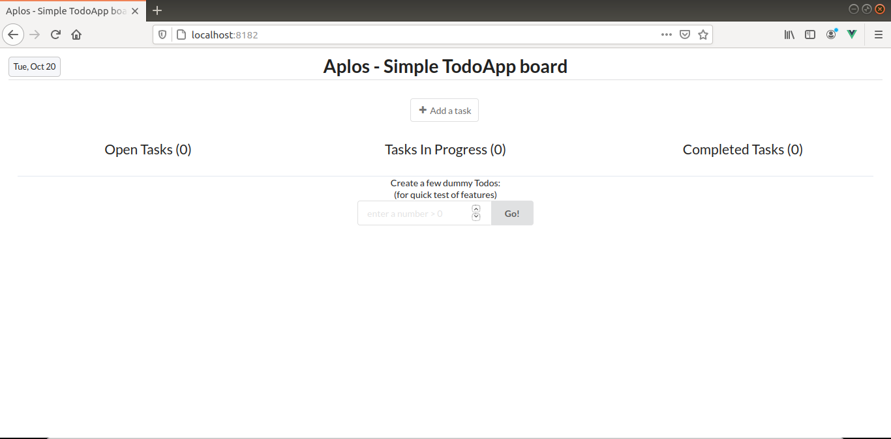

# Vue.js ToDo App

This is a basic one-page ToDo app, written with [vue.js v2](https://vuejs.org/) (for app logic), [semantic-ui](https://semantic-ui.com) (for styling) and [sweetAlert](https://sweetalert.js.org/) (for modal windows - primarily in versions 0.1 to 0.4).

This app is designed just for personal use on a single device: it stores data in your local browser only. It allows ToDo cards to be created, edited, moved from one status to another, and deleted.

v0.1: The page contains two columns: one for Open Tasks and one for Completed Tasks. ToDo items have a title and project description. There's no permanent storage: everything entered is lost upon reload...

V0.2: Refactored and added new status and column for In Progress Tasks

v0.3: Added note and due date to ToDo item, with visual clues when items are almost due or past due.

v0.4: Added simple storage implementation to persist ToDo list in the browser's localStorage. Upon page reload the ToDo list is repopulated from storage.

v0.5: Replaced modal confirmation alerts with basic 1-step undo/redo functionality.


## Build Setup

The development build uses [WebPack](http://vuejs-templates.github.io/webpack/) (with hot reload) and [vue-loader](https://vue-loader.vuejs.org/).

``` bash
# install dependencies
npm install

# serve with hot reload at http://localhost:8181/
npm run dev
# or alternatively run
npm start
```

## Screen capture


